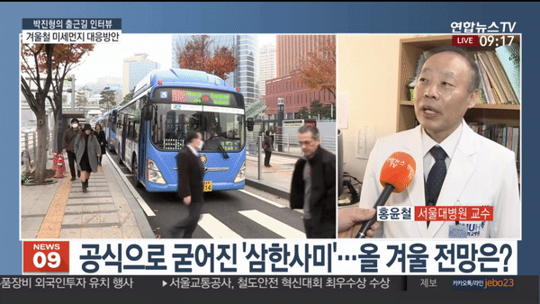
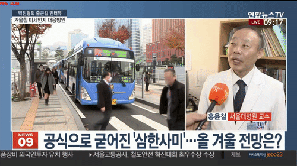

[캡스톤 디자인] Deep Sort 알고리즘을 활용한 초상권 보호 모자이크 프로그램
======================
****
# 1. Deep Sort
Deep learning + SORT(Simple online and realtime tracking) 알고리즘으로 SORT는 탐지된 객체의 경계상자를 이용하여 객체의 속도를 칼만 필터 (Kalman Filter)로 추정하여 다음 프레임에서 객체의 위치를 예측하는 방식으로 사용

# 2. 프로젝트 개요
딥러닝을 이용한 자동 모자이크 처리 프로그램은 실시간 영상 혹은 녹화된 영상에서 원하는 특정 인물을 제외하고 다른 인물의 얼굴을 인식하어 자동으로 모자이크 처리하는 프로그램이다. 
실시간 개체 추적을 수행하기 위해 YOLOv3 및 Deep SORT를 이용하여 얼굴을 인식하고, 모자이크 처리를 한다.

# 3. 제작 배경
최근 유튜브, 트위치, 아프리카 TV 등 인터넷 개인 방송 서비스가 유행하고 있다. 이러한 플랫폼을 통해 방송을 누구나 쉽게 시작 할 수 있게 되면서 남녀노소 불구하고 인터넷 상에 영상을 제작 및 배포를 할 수 있게 되었다. 하지만 쉬운 접근성 때문에 인터넷 상에서 벌어지는 무분별한 사진 및 동영상 공개로 초상권 침해에 대한 불만을 표하는 목소리가 커지고 있다. 이에 우리는 이 문제를 해결하고자 자동 모자이크 처리 프로그램 제작을 계획하게 되었다.

# 4. 환경구성 및 실행방법

#### Conda (Recommended)

```bash
# Tensorflow CPU
conda env create -f conda-cpu.yml
conda activate tracker-cpu

# Tensorflow GPU
conda env create -f conda-gpu.yml
conda activate tracker-gpu
```

#### Pip
```bash
# TensorFlow CPU
pip install -r requirements.txt

# TensorFlow GPU
pip install -r requirements-gpu.txt
```

### Nvidia Driver (For GPU, if you haven't set it up already)
```bash
# Ubuntu 18.04
sudo add-apt-repository ppa:graphics-drivers/ppa
sudo apt install nvidia-driver-430
# Windows/Other
https://www.nvidia.com/Download/index.aspx
```

### 모델 학습파일: [다운로드](https://drive.google.com/file/d/12NbqtPCAmQia4b4fmaBNVx81VDNYZeE_/view?usp=sharing)


### How to Run
```
# yolov3 on video
python object_tracker.py --video ./data/video/test.mp4 --output ./data/video/results.avi

# yolov3 on webcam 
python object_tracker.py --video 0 --output ./data/video/results.avi

```

#### 사용 예시
{: width="500" height="280"}

{: width="500" height="280"}


***** 

## ○ 참고문서
* [Yolov3 TensorFlow Amazing Implementation](https://github.com/zzh8829/yolov3-tf2)
* [Deep SORT Repository](https://github.com/nwojke/deep_sort)
* [Yolo v3 official paper](https://arxiv.org/abs/1804.02767)
* [Yolov3_deepsort](https://github.com/theAIGuysCode/yolov3_deepsort)
